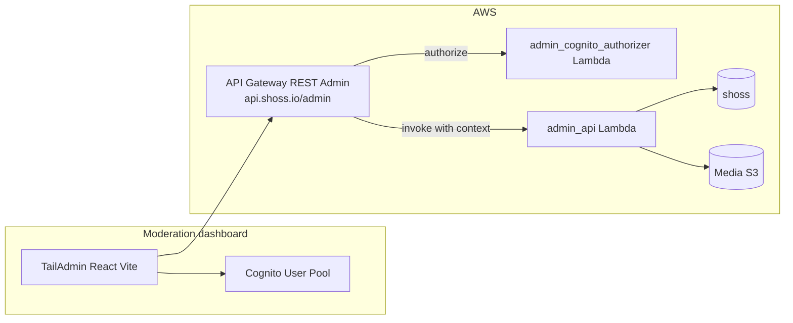

# Moderation dashboard — architecture & design specification

Simple staff dashboard for monitoring user activity, reviewing reports, and banning users.

**Related:** [System architecture](./system-architecture.md), [Chat architecture](./chat-architecture.md)  
**UI template:** [TailAdmin React (free)](https://tailadmin.com/) — Tailwind + React; pair with Vite.

---

## 1. Context from current backend types

### 1.1 User model (`backend/src/common/aws_lambdas/core_types/user.py`)

`UserRecord` supports all required moderation fields:

- **`type`**: `UserType` — `basic`, `admin`, `banned`, `developer`.
- **`moderation: UserModeration`**: `banFrom`, `banTo` (ISO timestamps), `banReason`, `banHistory`, `banCount`, `reportedCount`.
- **Usage signals**: `loginCount`, `lastActiveAt`, `createdAt`, `updatedAt`, `profileIds`, `platform`, `platformId`.

`UserManager.is_banned()`: user is banned if `type == banned` and `banTo` is missing (permanent) or in the future (temporary).

**Ban/unban semantics:** Temporary ban = `type: banned` + `banTo` in the future. Unban = restore `type` to `basic` (always) and archive ban fields into `banHistory`.

### 1.2 Profile model (`backend/src/common/aws_lambdas/core_types/profile.py`)

`ProfileRecord`: `profileType` (`public` / `anonymous`), `profileName`, `nickName`, `aboutMe`, `post` (`PostRecord`), `mediaRecords` / `mediaIds`, `lastLocation`, `lastSeen`.

All profile data — including anonymous profiles — is fully visible to moderators. Media preview uses S3 presigned URLs (5-minute TTL); raw bucket keys are never returned by the admin API.

---

## 2. Product goals

| # | Capability |
|---|------------|
| 1 | Users table with search and basic usage info |
| 2 | Ban / unban users (temporary or permanent) |
| 3 | View user profiles and media (read-only) |
| 4 | Reports queue — list, view, resolve |

---

## 3. Architecture

- **Frontend:** `dashboard/` directory. Stack: **React 19 + TypeScript + Vite + TailAdmin (free)**. Auth: direct Cognito API calls via `src/lib/cognitoAuth.ts` (no Amplify library).
- **Backend:** `backend/src/services/admin/` — two Lambdas + a dedicated API Gateway. Mounted at `/admin` base path on the shared `api.shoss.io` custom domain. Separate from the public user API so Cognito staff tokens and Telegram JWTs stay isolated.



---

## 4. Security and authentication

### 4.1 Cognito login

- **Amazon Cognito User Pool** (`shoss-admin-pool-{env}`) is the only staff identity store.
- **Frontend:** Custom `src/lib/cognitoAuth.ts` — direct Cognito API calls using `USER_PASSWORD_AUTH` flow (no Amplify library). After sign-in, attaches the Cognito access token as `Authorization: Bearer …` on all admin API calls. Tokens stored in `localStorage` under key `shoss_admin_tokens`.
- **First-login flow:** Handles `NEW_PASSWORD_REQUIRED` challenge inline on the sign-in page. Staff enter their new password before proceeding. On first login (or whenever MFA hasn't been enrolled), Cognito returns `MFA_SETUP`: the dashboard calls `AssociateSoftwareToken`, shows a QR code (via `qrcode.react`) and a copyable manual key, then verifies the first TOTP code with `VerifySoftwareToken` before completing sign-in.
- **Token refresh:** Automatic via `REFRESH_TOKEN_AUTH` on page load using the stored refresh token.
- **Token validity:** Access token = 8 h, ID token = 8 h, refresh token = 30 days.
- **Lambda authorizer (`admin_cognito_authorizer`):** Validates Cognito JWT (both access tokens and ID tokens are accepted). Verifies issuer, client ID / audience, and expiry. Injects `sub`, `email`, and `cognito:groups` into the API Gateway context. Authorizer result TTL: 300 s.
- **Staff accounts** are managed directly in the AWS Console / Cognito Console. No staff CRUD via the dashboard API.
- **Bootstrap:** First admin user created manually via AWS Console or CLI.

**Cognito pool settings:**
- Username attribute: email.
- Password policy: min 12 chars, uppercase, lowercase, numbers, symbols. Temporary password valid 7 days.
- MFA: **required** TOTP (`SOFTWARE_TOKEN_MFA`, `MfaConfiguration: ON`). Every staff account must enroll an authenticator app.
- `AllowAdminCreateUserOnly: true` — self-registration is disabled.
- Auth flows enabled: `USER_PASSWORD_AUTH`, `USER_SRP_AUTH`, `REFRESH_TOKEN_AUTH`.

**Do not** reuse Telegram Mini App JWTs for the dashboard.

### 4.2 Authorization

Two Cognito groups: `moderator` (precedence 10) and `admin` (precedence 5). For this dashboard both have identical permissions — the distinction is reserved for future policy if needed. All authenticated staff can: list/search users, view profiles, ban/unban, view and resolve reports.

---

## 5. Data model

No new DynamoDB tables or GSIs required. All access uses existing tables and indexes.

### 5.1 Existing access patterns

- **Users:** `PK = USER#{userId}`, `SK = METADATA`. GSI2 (`GSI2PK = USER#ALL`) lists all users.
- **Profiles:** `PK = PROFILE#{profileId}`, `SK = METADATA`. GSI1 (`GSI1PK = USER#{userId}`) lists profiles per user.

### 5.2 Report entity

Implemented in `core_types/report.py` (`ReportRecord`) and `core/report_utils.py` (`ReportManager`).

**DynamoDB keys** (one record per reporter→violator profile pair):

| Key | Value |
|-----|-------|
| `PK` | `PROFILE#{violatorProfileId}` |
| `SK` | `REPORT#{reporterProfileId}` |
| `GSI2PK` | `REPORT#ALL` |
| `GSI2SK` | `REPORT#{reporterProfileId}` |

The reports queue uses the existing GSI2 with `GSI2PK = REPORT#ALL`. No new GSI needed.

**`ReportRecord` fields:**

- `status`: `open` | `in_review` | `resolved_dismissed` | `resolved_action_taken` | `resolved_auto`
- `category`: `harassment` | `spam` | `underage` | `inappropriate_content` | `impersonation` | `fake_profile` | `solicitation` | `child_safety` | `other`
- `context`: optional short text from reporter
- `weight`: int (default `1`)
- `ttl`: Unix timestamp (auto-expiry)
- `createdAt`, `updatedAt`: ISO timestamps

Notes:
- Frontend sends `subjectProfileId`; backend resolves to `subjectUserId`.
- `reportedCount` on `UserModeration` is a lifetime counter, incremented on each new report.

---

## 6. Backend — `admin` service

### 6.1 Lambdas

Stack naming: **`shoss-admin-*-{environment}`**. Located under `backend/src/services/admin/`.

| Lambda | Name | Responsibility |
|--------|------|----------------|
| `admin_cognito_authorizer` | `shoss-admin-cognito-authorizer-{env}` | Validate Cognito JWT; inject `sub`, `email`, groups into context |
| `admin_api` | `shoss-admin-api-{env}` | All dashboard operations |

CloudFormation stacks: 4 sequential templates — `01-iam`, `02-cognito`, `03-lambda`, `04-apigateway`.

### 6.2 API design

One API Gateway (`shoss-admin-api-{env}`) mounted at `/admin` on the shared custom domain. The Lambda handles routing internally based on method + `resource` field.

```
GET    /admin/hello           unauthenticated health check (MOCK, returns {"service":"shoss-admin"})
GET    /admin/v1  ?resource=<resource>&...filters/ids
POST   /admin/v1  body: { resource, action, ...payload }
DELETE /admin/v1  body: { resource, id, ...payload }   (wired in API GW; no handler implemented yet — returns 405)
```

**Resources and operations:**

| Method | `resource` | Purpose |
|--------|-----------|---------|
| `GET` | `users` | List users — filters: `banned`, `platform`, `cursor`, `limit`, text `search` |
| `GET` | `user` | Single user — param: `userId` |
| `GET` | `profiles` | List profiles for a user — param: `userId` |
| `GET` | `profile` | Single profile + signed media URLs (5-min TTL) — param: `profileId` |
| `GET` | `reports` | Paginated report queue (`ScanIndexForward=False`) — filters: `status`, `category`, `cursor`, `limit` |
| `GET` | `report` | Single report detail — params: `violatorProfileId`, `reporterProfileId` |
| `GET` | `media_url` | Short-lived S3 presigned URL (5-min TTL) — param: `mediaId` |
| `POST` | `ban` | Ban user — payload: `userId`, `reason`, optional `banTo` (absent = permanent) |
| `POST` | `unban` | Unban user — payload: `userId` |
| `POST` | `resolve_report` | Resolve report — payload: `violatorProfileId`, `reporterProfileId`, `status`, optional `note` |

**`resolve_report` accepted statuses:** `in_review`, `resolved_dismissed`, `resolved_action_taken`. (`resolved_auto` is set by automation only.)

**Pagination:** cursor = base64-encoded DynamoDB `LastEvaluatedKey`. Default page size: 50, max: 100.

**Implementation:** Same handler pattern as existing services: `lambda_handler` → handler class → `ResponseError` / `generate_response` from `rest_utils`.

### 6.3 Ban enforcement

On ban: update `UserRecord` fields and append to `banHistory` (via `UserManager.apply_ban`). Then look up active WebSocket connections: for each `profileId` in the user's `profileIds`, fetch `PK=CONNECTION#{profileId}`, `SK=SESSION` from DynamoDB, post a `{"type":"banned","userId":"..."}` payload to the connection via the API Gateway Management API, and delete stale `GoneException` connection records. No in-app notification. On re-login, `UserManager.is_banned()` detects the ban and the auth flow returns a ban error to the client.

---

## 7. Frontend (TailAdmin free + Vite)

### 7.1 Setup

- Vite 6 + React 19 + TypeScript 5.7; TailAdmin free template for layout (sidebar, header). No Amplify library.
- Auth: `src/lib/cognitoAuth.ts` — thin wrapper over the Cognito REST API (`USER_PASSWORD_AUTH`). Token refresh on page load via `AuthContext`.
- Env vars: `VITE_ADMIN_API_BASE`, `VITE_COGNITO_CLIENT_ID`, `VITE_COGNITO_REGION`.
- Key dependencies: react-router 7, Tailwind CSS 4, react-helmet-async, clsx, tailwind-merge, qrcode.react (TOTP QR codes).

### 7.2 Pages

| Page | Route | Status | Content |
|------|-------|--------|---------|
| Login | `/login` | **Done** | Cognito sign-in; handles `NEW_PASSWORD_REQUIRED`, `SOFTWARE_TOKEN_MFA`, and `MFA_SETUP` (QR code enrollment) challenges inline |
| Home | `/` | **Scaffold** | Placeholder — "Moderation tools and user management coming soon" |
| Users | — | Planned | Table: platform, type, loginCount, lastActive, reportedCount, ban status |
| User detail | — | Planned | Profile list, ban/unban actions |
| Reports | — | Planned | Paginated queue with status/category filters |
| Report detail | — | Planned | Reporter, violator profile card, category, context, media preview, resolve action |

### 7.3 UX notes

- Ban and unban require a single confirmation dialog (no typed confirmation needed for this scale).
- Report resolution: single dropdown (dismiss / action taken) + optional note.

---

## 8. Delivery

### Completed

- Cognito User Pool + `admin_cognito_authorizer` + `admin_api` (all operations wired)
- CloudFormation stacks: IAM, Cognito, Lambda, API Gateway
- Dashboard shell: auth flow (sign-in, first-login password reset, token refresh, logout)

### Remaining (P0)

1. User list page + search
2. User detail page + ban/unban actions
3. Profile view + media preview
4. Reports queue + report detail + resolve
5. Home page KPIs (open reports count, active bans, new users today)

---

## 9. Implementation pointers

- Types: `backend/src/common/aws_lambdas/core_types/user.py`, `profile.py`, `media.py`, `report.py`
- User writes: `backend/src/common/aws_lambdas/core/user_utils.py` (`UserManager`)
- Profile GSI: `backend/src/common/aws_lambdas/core/profile_utils.py` (`ProfileManager`)
- Report / block: `backend/src/common/aws_lambdas/core/report_utils.py` (`ReportManager`, `BlockManager`)
- Admin service: `backend/src/services/admin/`
- Dashboard: `dashboard/src/`
- Backend conventions: `.cursor/rules/backend-coding-rules.mdc`, `backend-cloudformation.mdc`
