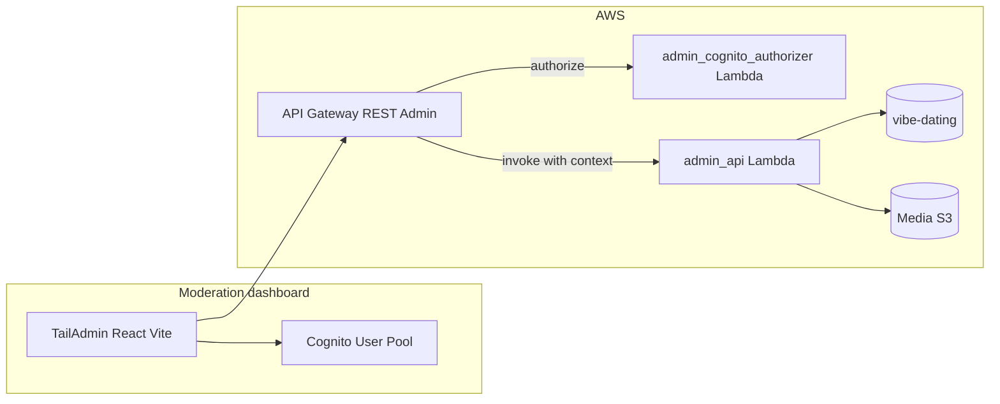

# Moderation dashboard — architecture & design specification

Simple staff dashboard for monitoring user activity, reviewing reports, and banning users.

**Related:** [System architecture](./system-architecture.md), [Chat architecture](./chat-architecture.md)  
**UI template:** [TailAdmin React (free)](https://tailadmin.com/) — Tailwind + React; pair with Vite.

---

## 1. Context from current backend types

### 1.1 User model (`backend/src/common/aws_lambdas/core_types/user.py`)

`UserRecord` supports all required moderation fields:

- **`type`**: `UserType` — `basic`, `admin`, `banned`, `developer`.
- **`moderation: UserModeration`**: `banFrom`, `banTo` (ISO timestamps), `banReason`, `banHistory`, `banCount`, `reportedCount`.
- **Usage signals**: `loginCount`, `lastActiveAt`, `createdAt`, `updatedAt`, `profileIds`, `platform`, `platformId`.

`UserManager.is_banned()`: user is banned if `type == banned` and `banTo` is missing (permanent) or in the future (temporary).

**Ban/unban semantics:** Temporary ban = `type: banned` + `banTo` in the future. Unban = restore `type` to `basic` (always) and archive ban fields into `banHistory`.

### 1.2 Profile model (`backend/src/common/aws_lambdas/core_types/profile.py`)

`ProfileRecord`: `profileType` (`public` / `anonymous`), `profileName`, `nickName`, `aboutMe`, `post` (`PostRecord`), `mediaRecords` / `mediaIds`, `lastLocation`, `lastSeen`.

Media preview in the dashboard uses S3 presigned URLs. Raw bucket keys are never returned by the admin API.

---

## 2. Product goals

| # | Capability |
|---|------------|
| 1 | Users table with search and basic usage info |
| 2 | Ban / unban users (temporary or permanent) |
| 3 | View user profiles and media (read-only) |
| 4 | Reports queue — list, view, resolve |

---

## 3. Architecture

- **Frontend:** `admin-dashboard/` directory. Stack: **React + TypeScript + Vite + TailAdmin (free)**. Auth: **Amazon Cognito** (Amplify Auth or Hosted UI).
- **Backend:** `backend/src/services/admin/` — two Lambdas + a dedicated API Gateway. Separate domain from the public user API so Cognito staff tokens and Telegram JWTs stay isolated.

---

## 4. Security and authentication

### 4.1 Cognito login

- **Amazon Cognito User Pool** is the only staff identity store.
- **Frontend:** Amplify Auth (PKCE) or Hosted UI redirect. After sign-in, attach the Cognito access token as `Authorization: Bearer …` on all admin API calls.
- **Lambda authorizer (`admin_cognito_authorizer`):** Validates JWT issuer, audience/client id, and expiry. Injects `sub`, `email`, and `cognito:groups` into the API Gateway context.
- **Staff accounts** are managed directly in the AWS Console / Cognito Console. No staff CRUD via the dashboard API.
- **Bootstrap:** First admin user created manually via AWS Console or CLI.

**Do not** reuse Telegram Mini App JWTs for the dashboard.

### 4.2 Authorization

Two Cognito groups: `moderator` and `admin`. For this dashboard both have identical permissions — the distinction is reserved for future policy if needed. All authenticated staff can: list/search users, view profiles, ban/unban, view and resolve reports.

---

## 5. Data model

No new DynamoDB tables or GSIs required. All access uses existing tables and indexes.

### 5.1 Existing access patterns

- **Users:** `PK = USER#{userId}`, `SK = METADATA`. GSI2 (`GSI2PK = USER#ALL`) lists all users.
- **Profiles:** `PK = PROFILE#{profileId}`, `SK = METADATA`. GSI1 (`GSI1PK = USER#{userId}`) lists profiles per user.

### 5.2 Report entity

Implemented in `core_types/report.py` (`ReportRecord`) and `core/report_utils.py` (`ReportManager`).

**DynamoDB keys** (one record per reporter→violator profile pair):

| Key | Value |
|-----|-------|
| `PK` | `PROFILE#{violatorProfileId}` |
| `SK` | `REPORT#{reporterProfileId}` |
| `GSI2PK` | `REPORT#ALL` |
| `GSI2SK` | `REPORT#{reporterProfileId}` |

The reports queue uses the existing GSI2 with `GSI2PK = REPORT#ALL`. No new GSI needed.

**`ReportRecord` fields:**

- `status`: `open` | `in_review` | `resolved_dismissed` | `resolved_action_taken` | `resolved_auto`
- `category`: `harassment` | `spam` | `underage` | `inappropriate_content` | `impersonation` | `fake_profile` | `solicitation` | `child_safety` | `other`
- `context`: optional short text from reporter
- `weight`: int (default `1`)
- `ttl`: Unix timestamp (auto-expiry)
- `createdAt`, `updatedAt`: ISO timestamps

Notes:
- Frontend sends `subjectProfileId`; backend resolves to `subjectUserId`.
- `reportedCount` on `UserModeration` is a lifetime counter, incremented on each new report.

### 5.3 Block entity

Implemented in `core_types/report.py` (`BlockRecord`) and `core/report_utils.py` (`BlockManager`).

Two mirrored DynamoDB items per block (one per direction). Dashboard uses this for display only (read-only access to block records).

---

## 6. Backend — `admin` service

### 6.1 Lambdas

Stack naming: **`vibe-dating-admin-*-{environment}`**.

| Lambda | Responsibility |
|--------|----------------|
| `admin_cognito_authorizer` | Validate Cognito JWT; inject `sub`, `email`, groups into context |
| `admin_api` | All admin REST routes |

### 6.2 REST API (`/admin/v1`)

Dedicated API Gateway; CORS restricted to dashboard origin.

**Users**

- `GET /admin/v1/users` — Paginated list; filters: `banned`, `platform`, text search
- `GET /admin/v1/users/{userId}` — Full user record
- `POST /admin/v1/users/{userId}/ban` — Body: `reason`, optional `banTo` (ISO), `permanent`
- `POST /admin/v1/users/{userId}/unban`

**Profiles**

- `GET /admin/v1/users/{userId}/profiles` — List profiles for a user
- `GET /admin/v1/profiles/{profileId}` — Full profile + signed media URLs

**Reports**

- `GET /admin/v1/reports?status=&category=&cursor=` — Paginated queue
- `GET /admin/v1/reports/{violatorProfileId}/{reporterProfileId}` — Report detail
- `PATCH /admin/v1/reports/{violatorProfileId}/{reporterProfileId}` — Update status / notes

**Media**

- `GET /admin/v1/media/{mediaId}/preview-url` — Short-lived S3 presigned URL for review

**Implementation:** Same handler pattern as existing services: `lambda_handler` → handler class → `ResponseError` / `generate_response` from `rest_utils`; managers for DynamoDB.

### 6.3 Ban enforcement

On ban: update `UserRecord` fields and append to `banHistory`, then send a logout/disconnect message to the user's active WebSocket session to force them out immediately. No in-app notification. On re-login, `UserManager.is_banned()` detects the ban and the auth flow returns a ban error to the client.

---

## 7. Frontend (TailAdmin free + Vite)

### 7.1 Setup

- Vite + React + TypeScript; TailAdmin free template for layout (sidebar, header).
- Env vars: `VITE_ADMIN_API_BASE`, `VITE_COGNITO_USER_POOL_ID`, `VITE_COGNITO_CLIENT_ID`, `VITE_COGNITO_REGION`.
- Amplify Auth handles token refresh automatically.

### 7.2 Pages

| Page | Content |
|------|---------|
| Login | Cognito sign-in |
| Home | KPIs: open reports count, active bans, new users today |
| Users | Table: platform, type, loginCount, lastActive, reportedCount, ban status |
| User detail | Profile list, ban/unban actions |
| Reports | Paginated queue with status/category filters |
| Report detail | Reporter, violator profile card, category, context, media preview, resolve action |

### 7.3 UX notes

- Ban and unban require a single confirmation dialog (no typed confirmation needed for this scale).
- Report resolution: single dropdown (dismiss / action taken) + optional note.

---

## 8. Delivery

Single phase. All items are P0:

1. Cognito User Pool + `admin_cognito_authorizer` + `admin_api`
2. User list, detail, ban/unban
3. Profile view + media preview URL
4. Reports queue + report detail + resolve
5. TailAdmin shell wired to the API

---

## 9. Implementation pointers

- Types: `backend/src/common/aws_lambdas/core_types/user.py`, `profile.py`, `media.py`, `report.py`
- User writes: `backend/src/common/aws_lambdas/core/user_utils.py` (`UserManager`)
- Profile GSI: `backend/src/common/aws_lambdas/core/profile_utils.py` (`ProfileManager`)
- Report / block: `backend/src/common/aws_lambdas/core/report_utils.py` (`ReportManager`, `BlockManager`)
- Admin service: `backend/src/services/admin/`
- Backend conventions: `.cursor/rules/backend-coding-rules.mdc`, `backend-cloudformation.mdc`
