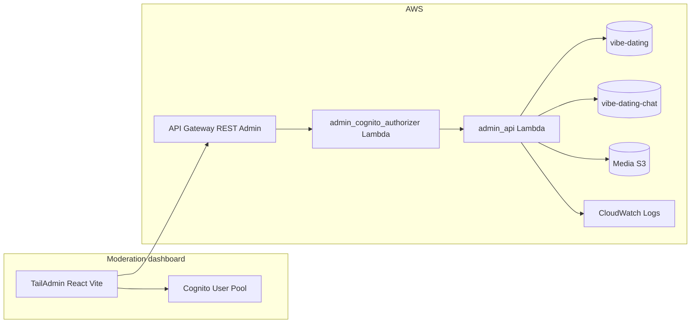

# Moderation platform — architecture & design specification

This document describes the moderation dashboard (separate from the Telegram mini-app frontend) and the **`admin` backend service** (Lambdas + API Gateway in-repo), aligned with existing Vibe Dating types and AWS serverless patterns.

**Related:** [System architecture](./system-architecture.md), [Chat architecture](./chat-architecture.md)  
**UI template:** [TailAdmin React](https://tailadmin.com/) (Tailwind + React; pair with Vite in a new admin app)

---

## 1. Context from current backend types

### 1.1 User model (`backend/src/common/aws_lambdas/core_types/user.py`)

`UserRecord` already supports operational moderation fields:

- **`type`**: `UserType` includes `basic`, `admin`, `banned`, `developer` — bans align with `banned`.
- **`moderation: UserModeration`**: `banFrom`, `banTo` (ISO timestamps), `banReason`, `banHistory`, `banCount`, `reportedCount`.
- **Usage signals**: `loginCount`, `lastActiveAt` / `createdAt` / `updatedAt` (from `UserManager.upsert`), `profileIds`, `activeProfileId`, `platform` / `platformId`, `platformMetadata`, `limits`.

`UserManager.is_banned()` defines runtime semantics: user is banned if `type == banned` and either `banTo` is missing (permanent) or current time is before parsed `banTo`.

**Implication:** Ban/unban in the dashboard must update `type` and `moderation` consistently so existing auth/login paths keep working. **Temporary ban** = `type: banned` + `banTo` in the future. **Unban** = restore prior type (typically `basic`) and clear or archive ban fields in `banHistory`.

### 1.2 Profile model (`backend/src/common/aws_lambdas/core_types/profile.py`)

`ProfileRecord` holds data for profile-card review: `profileType` (`public` / `anonymous`), `profileName`, `nickName`, `aboutMe`, `post` (`PostRecord`: `content`, `mediaIds`, `createdAt`), `mediaRecords` / `mediaIds`, `lastLocation`, `lastSeen`, `ttl`.

`MediaAttributes` on profile includes `status` (maps to `MediaStatus`: `pending`, `processing`, `ready`, `error`), `association` (`profile` | `post` | `chat`), `mimeType`, `privacy`, `flags`.

**Implication:** Media review should use the same S3 + signed-URL patterns as the app, with **moderator-only** presigned read. Avoid exposing raw bucket keys in the dashboard API; return short-lived URLs.

### 1.3 Gaps today

- **No first-class “report” entity** in code: `reportedCount` is a counter only; chat docs reference reporting as future work.
- **No `MediaStatus` value** for moderator decisions (e.g. `rejected` / `moderation_hold`): only pipeline states exist.

The moderation project **adds** report records, optional media moderation overlays, and admin APIs — without breaking `msgspec` validation for app-facing writes.

---

## 2. Product goals

| # | Capability | Priority |
|---|------------|----------|
| 1 | Users/profiles table with filters and usage | P0 |
| 2 | Ban / unban users | P0 |
| 3 | Queue of user reports (chat, profile, post/media) | P0 |
| 4 | Review reported media; allow / remove from product | P0 |
| 5 | Delete user or single profile (with safeguards) | P1 |
| 6 | Global usage reports (aggregates + exports) | P1 |

---

## 3. High-level architecture

- **Dashboard frontend:** New app directory (e.g. `moderation-dashboard/` or `admin-dashboard/`), **not** the Telegram mini-app. Stack: **React + TypeScript + Vite + Tailwind**, shell from **TailAdmin React**. **Authentication:** [Amazon Cognito](https://docs.aws.amazon.com/cognito/latest/developerguide/) User Pool (hosted UI or Amplify Auth in the SPA). Note: the main app uses Tailwind v4; align or adapt TailAdmin component utilities when integrating.
- **Backend service name:** **`admin`**. Code and CloudFormation live under **`backend/src/services/admin/`** (same patterns as other services: Lambdas, `msgspec` in `core_types`, `CommonManager` / `DynamoDBService`). Prefer a **separate HTTP API** (and domain) from the public user API so Cognito staff tokens and Telegram JWT stay isolated.

---

## 4. Security and authentication

### 4.1 Dashboard login — Amazon Cognito (required)

- **Amazon Cognito User Pool** is the **only** staff identity store for the dashboard.
- **Groups:** at minimum `moderator` and `admin` (Cognito group names match API authorization checks).
- **Frontend:** Authenticate with Cognito (e.g. **Amplify Auth** + PKCE, or **Hosted UI** redirect). After sign-in, attach **Cognito access token** (or ID token, per authorizer design) to `Authorization: Bearer …` on calls to the admin API.
- **API Gateway authorizer:** Lambda **`admin_cognito_authorizer`** (parallel to `auth_jwt_authorizer` for the mini-app): validate JWT **issuer** (User Pool), **audience** / client id, **expiry**, and **cognito:groups** (or equivalent claims). Inject into context: `sub` (Cognito user id), `email`, `cognito:groups` / derived role (`moderator` | `admin`).

**Do not** reuse Telegram Mini App JWTs for the dashboard: different threat model, rotation, and audience.

**Bootstrap:** The **first** admin user is created manually (AWS Console, CLI, or one-off deployment script). After that, **admins add further accounts** via the dashboard (see §4.4).

### 4.2 Authorization matrix

| Action | moderator | admin |
|--------|-----------|-------|
| List/search users, profiles, reports | yes | yes |
| Resolve reports (dismiss / escalate) | yes | yes |
| Ban/unban | yes (policy-defined) | yes |
| Delete profile | yes | yes |
| Delete user (full) | no or dual-control | yes |
| Change `UserType.admin` / `developer` (app users) | no | yes |
| Export PII-heavy reports | restricted | yes |
| **Create staff accounts** (Cognito users + group assignment) | no | **yes** |
| **Disable / remove staff** (Cognito admin APIs) | no | **yes** |
| **Promote staff** (`moderator` ↔ `admin` groups) | no | **yes** (policy-defined) |

### 4.3 Audit log (required)

Append-only pattern: separate table `vibe-dating-audit-{env}` or items with `PK = AUDIT#date`, `SK = timestamp#id`.

Fields: `actorStaffId`, `action`, `targetType` (`user` | `profile` | `media` | `report`), target IDs, `payloadSummary`, `ip`, `userAgent`, UTC time.

Mutating admin endpoints should record audit entries (same transaction where possible, or immediately after with idempotency key).

### 4.4 Admin-managed staff accounts (Cognito)

Users in the **`admin`** Cognito group may **provision additional dashboard operators** without using the AWS Console for day-to-day operations.

**Behavior:**

- **Create:** `admin_api` calls **`cognito-idp:AdminCreateUser`** (email/username, optional temporary password, `MessageAction` for invite email). Then **`AdminAddUserToGroup`** to assign `moderator` or `admin`.
- **List:** **`ListUsers`** / **`AdminListGroupsForUser`** (paginated) for a **Team** screen in the dashboard.
- **Update:** **`AdminSetUserPassword`** (force change on first login), **`AdminUpdateUserAttributes`**, **`AdminDisableUser`** / **`AdminEnableUser`**.
- **Remove from dashboard access:** **`AdminRemoveUserFromGroup`** or **`AdminDeleteUser`** (policy: prefer disable over delete for audit trail).

**IAM:** Execution role for `admin_api` grants **only** the target User Pool ARN for these actions.

**Audit:** Every staff CRUD action writes an audit record (`targetType: staff`, Cognito `sub`, action, actor admin `sub`).

**Safeguards:**

- Prevent removing the **last** `admin` group member (or last user matching a break-glass allowlist).
- Optional **MFA** enforced on the User Pool for `admin` group (Cognito MFA settings + app policy).

---

## 5. Data model extensions (DynamoDB)

Remain in **`vibe-dating-{env}`** single-table design unless volume forces a split.

### 5.1 Existing access patterns

- Users: `PK = USER#{userId}`, `SK = METADATA`; **GSI2** indexes all users: `GSI2PK = USER#ALL`, `GSI2SK = USER#{userId}` (see `UserManager.upsert`).
- Profiles: `PK = PROFILE#{profileId}`, `SK = METADATA`; `GSI1PK = USER#{userId}`, `GSI1SK = PROFILE#{profileId}`.

**List users (admin):** Query `GSI2` with `GSI2PK = USER#ALL`, paginate on `GSI2SK`. At scale, add sparse GSIs for flagged users or use OpenSearch.

### 5.2 Report entity (new)

**Purpose:** In-app reports from reporter → subject (user/profile/chat message/media).

Suggested keys:

- `PK = REPORT#{reportId}`, `SK = METADATA`
- **Queue GSI:** e.g. `GSI4PK = REPORT#OPEN`, `GSI4SK = {createdAt}#{reportId}` — requires a **new GSI** in CloudFormation. Alternative at low volume: `PK = REPORT#QUEUE`, `SK = {status}#{createdAt}#{reportId}` (watch hot partitions).

**Illustrative fields:**

- `reportId`, `createdAt`, `updatedAt`, `status` (`open` | `in_review` | `resolved_dismissed` | `resolved_action_taken`)
- `category` (harassment, spam, underage, impersonation, other)
- `reporterUserId`, optional `reporterProfileId`
- `subjectType` (`user` | `profile` | `chat_message` | `media`)
- `subjectUserId`, `subjectProfileId` as applicable
- `chatThreadId`, `messageId` (chat table)
- `mediaId`, `association` (profile/post/chat)
- `context` (short text; avoid large blobs in DynamoDB)
- `assignedToStaffId`, `resolutionNote`, `resolvedByStaffId`, `resolvedAt`
- optional `linkedModerationActionId`

**Counters:** On create, increment `user.moderation.reportedCount` on subject user. Document whether `reportedCount` is lifetime vs “open reports” only.

### 5.3 Media moderation overlay (new)

Prefer **not** overloading `MediaStatus` for the mobile app unless the enum is extended deliberately.

**Recommended:** Optional fields on `profile.mediaRecords[mediaId]`:

- `moderationStatus`: `approved` | `rejected` | `pending_review`
- `moderationReason`, `moderatedAt`, `moderatedByStaffId`

**Alternative:** `PK = MEDIA_MOD#{mediaId}`, `SK = METADATA` with `profileId` / `userId` for joins.

**Product:** `feed_query` and chat surfaces exclude `rejected` (and optionally `pending_review`). In-app copy for owners is a product decision.

### 5.4 Soft delete vs hard delete

- **Soft delete:** Tombstone flags + remove feed-related GSIs or stop indexing.
- **Hard delete:** Remove `USER`, related `PROFILE` items, S3 objects for owned media; define chat retention/redaction policy (legal/product).

Document retention for GDPR / Telegram obligations.

---

## 6. Backend service design — `admin` service (Lambdas)

### 6.1 Lambdas

Stack naming follows the repo convention: **`vibe-dating-admin-*-{environment}`** (see `.cursor/rules/backend-cloudformation.mdc`).

| Lambda | Responsibility |
|--------|----------------|
| `admin_cognito_authorizer` | Validate Cognito JWT (User Pool); inject `sub`, groups, email into context |
| `admin_api` | REST routing for all admin dashboard operations (or split read/write later) |

Optional:

- `admin_reports_worker` — DynamoDB Streams → notifications
- `admin_metrics_daily` — EventBridge → aggregates

### 6.2 REST API outline (`/admin/v1`)

Host on a dedicated API (e.g. `https://admin-api.vibe-dating.io`); CORS limited to dashboard origin.

**Users**

- `GET /admin/v1/users` — Cursor pagination; filters: `type`, `banned`, `createdAfter`, `platform`, search
- `GET /admin/v1/users/{userId}` — Full user (redact sensitive `platformMetadata` if needed)
- `POST /admin/v1/users/{userId}/ban` — Body: `reason`, optional `banTo` (ISO), `permanent`
- `POST /admin/v1/users/{userId}/unban`
- `DELETE /admin/v1/users/{userId}` — Hard delete (admin-only); may return async job id

**Profiles**

- `GET /admin/v1/users/{userId}/profiles`
- `GET /admin/v1/profiles/{profileId}` — Full profile + signed media URLs
- `DELETE /admin/v1/profiles/{profileId}` — Align with existing profile delete / cascade

**Reports**

- `GET /admin/v1/reports?status=&category=&cursor=`
- `GET /admin/v1/reports/{reportId}`
- `PATCH /admin/v1/reports/{reportId}` — Assign, status, notes
- `POST /admin/v1/reports/{reportId}/actions` — Composite actions (ban + reject media + resolve)

**Media**

- `POST /admin/v1/media/{mediaId}/moderate` — Body: `decision` (`allow` | `ban`), `reason`
- `GET /admin/v1/media/{mediaId}/preview-url` — Short-lived signed URL

**Analytics**

- `GET /admin/v1/metrics/summary?from=&to=`
- `GET /admin/v1/metrics/export?from=&to=&format=csv` — Presigned S3 URL when large

**Staff (Cognito) — `admin` group only**

- `GET /admin/v1/staff` — List pool users / group membership (paginated; dashboard Team page)
- `POST /admin/v1/staff` — Create user, optional invite email, assign `moderator` | `admin` group
- `PATCH /admin/v1/staff/{cognitoSub}` — Update attributes, enable/disable, reset password flow
- `POST /admin/v1/staff/{cognitoSub}/groups` — Add/remove group membership (`moderator` / `admin`)

**Implementation:** Same handler style as existing services: `lambda_handler` → `AdminApiHandler` (name suggestion) → `ResponseError` / `generate_response` from `rest_utils`; managers for DynamoDB; Cognito via `boto3` client with least-privilege IAM.

### 6.3 Chat-linked reports

For reports referencing chat messages: read from **`vibe-dating-chat-{env}`** by thread/message keys. If no public chat history REST API exists yet, **`admin_api`** may query the chat table with read-only IAM.

### 6.4 Ban enforcement vs JWT

On ban: set `UserRecord` fields, append `banHistory`, optionally disconnect WebSockets. Existing JWTs may remain valid until expiry — mitigate via short TTL and/or ban check in authorizer (latency vs security tradeoff).

---

## 7. Frontend dashboard (TailAdmin + Vite)

### 7.1 Setup

- Vite + React + TypeScript; integrate TailAdmin layout (sidebar, header, dark mode).
- Env: `VITE_ADMIN_API_BASE`, **`VITE_COGNITO_USER_POOL_ID`**, **`VITE_COGNITO_CLIENT_ID`**, **`VITE_COGNITO_REGION`** (and Hosted UI domain if used).
- **Amazon Cognito** for sign-in; HTTP client sends **Cognito JWT** to API Gateway and refreshes tokens per Amplify/session policy.

### 7.2 Page map

| Page | Purpose |
|------|---------|
| Login | Cognito sign-in (Hosted UI or embedded Amplify flow) |
| **Team** | **Admin-only:** list staff, invite new moderators/admins, disable users, manage groups |
| Home | KPIs: open reports, bans today, new users |
| Users | Table: userId, platform, platformId, type, loginCount, lastActive, reportedCount, ban status, profile count |
| User detail | Tabs: Overview, Profiles, Reports, Ban actions, Danger zone |
| Profiles | Search by profileId / userId; cards + thumbnails |
| Reports queue | Filters, assignment, bulk assign |
| Report detail | Report metadata + profile card + chat excerpt + media |
| Media review | Queue for pending/reported media |
| Analytics | Charts and date ranges |
| Audit log | Search by actor / target |
| Settings | Feature flags (read-only initially) |

### 7.3 UX

- Destructive actions: typed confirmation; optional dual approval for full user delete.
- Minimize PII in lists; mask where policy requires.

---

## 8. Global usage reports

DynamoDB is weak for ad-hoc global analytics. Tiered approach:

1. **MVP:** Scheduled daily Lambda writes `PK = METRICS#{YYYYMMDD}`, `SK = SUMMARY`, or increment counters on write paths.
2. **Scale:** DynamoDB Streams → Firehose → S3 → Athena / QuickSight.
3. **Export:** CSV to S3 + presigned download URL.

---

## 9. Phased delivery

| Phase | Scope |
|-------|--------|
| P0 | Cognito User Pool + **`admin_cognito_authorizer`** + **`admin_api`**; user list/detail; ban/unban; audit log; TailAdmin shell; bootstrap first admin |
| P0.5 | **Team** page + staff CRUD via Cognito admin APIs (admin group only) |
| P1 | Report CRUD + queue GSI; report detail + signed media; media allow/ban + feed exclusion |
| P2 | Chat context on reports; user/profile delete + S3 cleanup job |
| P3 | Metrics rollups + exports; notifications; OpenSearch if needed |

---

## 10. Open decisions (ADR candidates)

1. Report queue: new GSI vs queue partition vs OpenSearch.
2. Ban enforcement: authorizer ban list vs JWT TTL only.
3. Media ban: hide vs delete S3 objects (cost vs legal hold).
4. Anonymous profiles: what moderators see vs subject linkage.
5. **Staff roles:** Whether `admin` vs `moderator` is **only** Cognito groups (recommended) or also mirrored in DynamoDB — app end-user `UserType.admin` remains separate from Cognito staff.

---

## 11. Traceability summary

| Requirement | Primary code / store |
|-------------|----------------------|
| Ban state | `UserType`, `UserModeration`, `UserManager.is_banned()` |
| Profile/post review | `ProfileRecord`, `PostRecord`, `mediaRecords` |
| Report volume hint | `moderation.reportedCount` (needs report write path) |
| User listing | DynamoDB GSI2 `USER#ALL` |

---

## 12. Implementation pointers (repo)

- Types: `backend/src/common/aws_lambdas/core_types/user.py`, `profile.py`, `media.py`
- User DDB write pattern: `backend/src/common/aws_lambdas/core/user_utils.py` (`UserManager`)
- Profile GSI: `backend/src/common/aws_lambdas/core/profile_utils.py` (`ProfileManager`)
- **Admin service layout:** `backend/src/services/admin/` (Lambdas: `admin_cognito_authorizer`, `admin_api`; CloudFormation stacks following existing service numbering)
- Backend conventions: `.cursor/rules/backend-coding-rules.mdc`, `backend-cloudformation.mdc`
