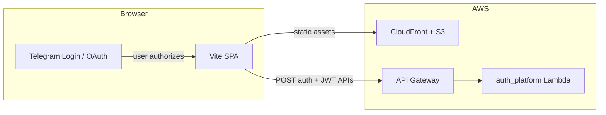

# Plan: Standalone web deployment with Telegram authentication

This document describes how to deploy Vibe Dating as a **normal browser web application** (not opened inside Telegram as a Mini App), while **keeping identity tied to Telegram**—users prove who they are via Telegram, then use the product entirely in a regular browser tab.

It complements the existing stack: React/Vite frontend on CloudFront+S3, Python Lambdas behind API Gateway, JWT sessions after platform auth.

---

## 1. Goals and constraints

| Goal | Detail |
|------|--------|
| **Standalone web** | App loads from `https://…` in Chrome/Safari/etc.; no requirement to be embedded in Telegram WebView. |
| **Telegram as IdP** | Account creation and login are still anchored to a Telegram user id (same `USER#` / `telegram:{id}` model as today). |
| **Minimal product change** | After login, the same REST APIs, WebSocket chat, media, and JWT authorizer behavior should apply. |
| **Mini App optional** | Existing Mini App build can remain; this plan adds a **web** entry path, not necessarily removing the TMA. |

**Non-goals (for this plan):** Replacing Telegram with email/password, or running without HTTPS.

---

## 2. Current state (Mini App)

- **Frontend** (`frontend/src/api/auth.ts`): Reads `initDataRaw()` and `initData.user()` from `@telegram-apps/sdk-react`, POSTs to `POST /auth/platform` with `platform: "telegram"` and `platformToken` = the **Web App init data** string.
- **Backend** (`auth_platform/telegram.py`): Verifies that string using Telegram’s **Web App** rules: HMAC key derived from `"WebAppData"` + bot token, then compares `hash` to the sorted `key=value` lines.
- **Shell** (`frontend/src/components/App.tsx`): Uses Mini App APIs (`expandViewport`, `requestFullscreen`, `isMiniAppDark`) and passes theme/platform into `@telegram-apps/telegram-ui` `AppRoot`.

**Important:** Telegram’s **Login Widget** (and related “login for websites” flows) use a **different** signing algorithm than Web App init data. The backend cannot reuse `_telegram_verify_data` as-is for widget payloads; it needs a second verifier (or a unified “telegram” auth module with two strategies).

---

## 3. Target architecture

- **Hosting:** Same pattern as today: static build to S3, CloudFront distribution, optional separate hostname (e.g. `app.vibe-dating.io`) from the Mini App URL (`tma.vibe-dating.io`).
- **API:** Same API Gateway base URL (`VITE_API_BASE_URL`); ensure **CORS** allows the web origin and required headers (`Authorization`, `Content-Type`).
- **Session:** Unchanged: short-lived JWT after successful Telegram verification, stored client-side (today: `LocalStorage` via `StorageKeys.UserAuth`).

---

## 4. Telegram authentication options (outside Mini App)

### 4.1 Recommended: Telegram Login Widget

- Embed the [official Login Widget](https://core.telegram.org/widgets/login) on a dedicated **Login** route (or landing page).
- On callback, Telegram supplies `id`, `first_name`, `hash`, `auth_date`, etc.
- **Backend** verifies `hash` per Telegram docs: `secret_key = SHA256(bot_token)`, then `HMAC_SHA256(secret_key, data_check_string)` compared to `hash`.
- **Pros:** Simple, well documented, no OAuth client registration beyond the bot; fits “login with Telegram” UX.
- **Cons:** Widget UI is Telegram-branded; domain must be configured for the bot (BotFather → Bot Settings → Domain).

### 4.2 Alternative: Telegram Login URL / OAuth-style flows

- Use Telegram’s authorization URL flow where appropriate for your UX (e.g. mobile-first redirect).
- Still ends in a signed payload the backend must verify (same or related verification as widget—**not** Web App init data).

### 4.3 Not sufficient alone

- **Deep links** to `t.me/...` that open the Mini App do not satisfy “pure web”; they are a second surface, not a replacement for browser auth.
- **Forwarding init data** from a bot message into the browser is fragile and not a standard pattern for production login.

---

## 5. Backend plan (`auth_platform`)

1. **Add a second request shape** (clearly distinguished from Mini App), for example:
   - `platform: "telegram"`, `platformTokenType: "login_widget"` (or separate endpoint `POST /auth/telegram/widget`), body fields matching widget callback parameters as JSON.
2. **Implement verification** for Login Widget (and reject Web App verifier for that path).
3. **Normalize user identity** to the same structure used today after Web App auth (`id`, optional `username`, `photo_url`, etc.) so user provisioning and JWT claims stay consistent.
4. **Reuse** existing JWT issuance and DynamoDB user linking (`telegram:{telegram_user_id}`).
5. **Security**
   - Enforce **freshness** of `auth_date` (reject stale callbacks, e.g. older than 24 hours).
   - Prefer **one-time use** or short-lived server-issued `state` if you add a server-mediated callback URL instead of pure client-side widget callback.
6. **CORS / API Gateway:** Allow `OPTIONS` and web `Origin`; keep authorizer unchanged for protected routes.

---

## 6. Frontend plan

1. **Build / entry**
   - Either a **second Vite entry** or **environment flag** (`VITE_APP_SURFACE=web` | `mini_app`) controlling bootstrap.
2. **Auth module** (`auth.ts` / `UserContext`)
   - **Mini App path:** keep `initializeTelegram()` using `initDataRaw()` + SDK.
   - **Web path:** new `initializeTelegramWeb()` that:
     - If JWT already in storage and valid, skip; else
     - Shows login UI and, on widget success, POSTs signed fields to the new backend contract; stores returned `AuthData` like today.
3. **Remove hard dependency on Mini App APIs in web mode**
   - `App.tsx`: guard `expandViewport`, `requestFullscreen`, `isMiniAppDark` so they no-op outside Telegram (or split `AppWeb.tsx` / `AppMiniApp.tsx`).
   - `AppRoot` `platform`: use `'base'` (or `tdesktop`) for web; theme from `prefers-color-scheme` or saved user preference only.
4. **Router**
   - `HashRouter` already suits static S3 hosting; **history mode** is possible if CloudFront error pages route `404` → `index.html` for the SPA path.
5. **Links**
   - `openLink` in `AppContext` should open `window.open` / `location.assign` on web; Telegram `openLink` only in Mini App.

---

## 7. Infrastructure and hosting

| Area | Action |
|------|--------|
| **S3 + CloudFront** | New bucket or prefix for web build; cache policies for hashed assets; `index.html` with shorter cache or no-cache as today. |
| **DNS** | CNAME for public web hostname. |
| **TLS** | ACM certificate in `us-east-1` for CloudFront. |
| **CORS** | API Gateway: allow web origin; expose needed headers. |
| **Secrets** | No new secret type: same bot token in Secrets Manager; widget verification uses the same token. |
| **WebSocket** | If chat uses a different origin, confirm API Gateway WebSocket CORS / browser behavior (cookies not used today; JWT in query/header per existing spec). |

---

## 8. Telegram / BotFather configuration

- Set the **domain** allowed for the Login Widget to the production web hostname (and staging if applicable).
- Ensure the bot token used by `auth_platform` matches the bot users log in through.
- Document whether **Mini App** and **Web** share one bot (simplest) or use separate bots (only if product/legal needs require it).

---

## 9. Phased rollout

1. **Phase A — Backend:** Widget (or chosen) verification + tests; staging deploy; contract documented in `docs/api/api-reference.md`.
2. **Phase B — Frontend web shell:** Web bootstrap without Telegram (theme, router, no Mini App crashes).
3. **Phase C — Web login:** Widget page + `initializeTelegramWeb` + end-to-end login to JWT.
4. **Phase D — Hosting:** CloudFront distribution, env-specific `VITE_API_BASE_URL`, smoke tests from real browsers.
5. **Phase E — Hardening:** Rate limits on auth endpoint, monitoring, `auth_date` window, optional CAPTCHA if abused.

---

## 10. Risks and open decisions

| Risk / question | Mitigation |
|-----------------|------------|
| Two Telegram signature algorithms | Isolate Web App vs Login Widget in code; integration tests for each. |
| User confusion (Mini App vs web) | Clear copy: “Open in browser” vs “Open in Telegram”; same account if same bot. |
| **iOS / in-app browsers** | Test Login Widget in Safari, Chrome, Telegram in-app browser if you still link from Telegram. |
| **JWT in LocalStorage** | Current pattern; for stricter threat model consider httpOnly cookies (larger change to API clients). |
| **Deep linking** | Decide whether web URLs appear in bot messages and how `start` params map to web (optional, product-specific). |

---

## 11. Documentation and acceptance criteria

- Update API reference with the web Telegram auth request/response.
- Acceptance: user can complete login on `https://<web-host>/` without Telegram client hosting the UI, receive JWT, load feed and chat, and session survives refresh until token expiry/logout.

---

## 12. References

- [Telegram Web Apps / init data](https://core.telegram.org/bots/webapps#validating-data-received-via-the-mini-app) (current backend behavior).
- [Telegram Login Widget / checking authorization](https://core.telegram.org/widgets/login#checking-authorization) (required for standalone web).
- Internal: `backend/src/services/auth/aws_lambdas/auth_platform/telegram.py`, `frontend/src/api/auth.ts`, `frontend/src/components/App.tsx`.
