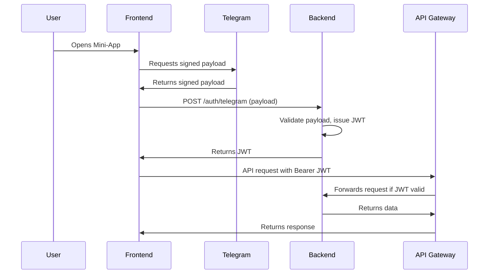

# Authentication Service

## Overview

This document outlines the authentication system for the Vibe REST API using AWS API Gateway, JWT tokens, and Telegram WebApp authentication. The system consists of two main Lambda functions: `auth_platform` for authentication and `auth_jwt_authorizer` for API authorization.

## Current Implementation

### Lambda Functions
- **`auth_platform`**: Handles Telegram WebApp authentication and JWT token issuance
- **`auth_jwt_authorizer`**: Validates JWT tokens for API Gateway authorization

### Authentication Flow
1. **Telegram WebApp**: Users authenticate via Telegram Mini-App SDK
2. **Platform Authentication**: Backend validates Telegram payload and issues JWT token
3. **API Access**: Frontend uses JWT token for all subsequent API requests
4. **Authorization**: API Gateway validates JWT tokens on every request

---

## 1. Authentication Flow

### 1.1. User Identity Source
- **Telegram WebApp**: Users authenticate via Telegram Mini-App SDK, which provides a signed payload containing user identity.

### 1.2. Token Issuance
- **Backend**: Validates Telegram payload, issues a JWT (JSON Web Token) for API access.
- **JWT Claims**: Includes `uid` (Vibe user ID), `iat`, `exp`, `iss`.

### 1.3. API Access
- **Frontend**: Attaches JWT as a Bearer token in the `Authorization` header for all API requests.
- **Backend**: Validates JWT on every request, checks claims, and enforces profile-level authorization.

---

## 2. Frontend Implementation

### 2.1. Telegram WebApp Integration

```typescript
// Initialize Telegram WebApp
const tg = window.Telegram.WebApp;

// Get Telegram authentication data
const initData = tg.initData;
const initDataUnsafe = tg.initDataUnsafe;

// Extract user information
const telegramUser = {
  id: initDataUnsafe.user?.id,
  username: initDataUnsafe.user?.username,
  first_name: initDataUnsafe.user?.first_name,
  // ... other Telegram user fields
};
```

### 2.2. Authentication State Management

```typescript
// Auth context for React
interface AuthState {
  isAuthenticated: boolean;
  token: string | null;
  userId: string | null;
  activeProfileId: string | null;
  profileIds: string[];
  limits: {
    maxProfilesCount: number;
    maxMediasPerProfile: number;
    maxMediaFileSize: number;
    maxMediaAllowedFormats: string;
  };
}

// Auth provider component
const AuthProvider = ({ children }) => {
  const [authState, setAuthState] = useState<AuthState>({
    isAuthenticated: false,
    token: null,
    userId: null,
    activeProfileId: null,
    profileIds: [],
    limits: {
      maxProfilesCount: 3,
      maxMediasPerProfile: 5,
      maxMediaFileSize: 20971520,
      maxMediaAllowedFormats: "jpeg,jpg,png,webp"
    }
  });

  const authenticate = async () => {
    try {
      // Send Telegram init data to backend for verification
      const response = await fetch('/auth/platform', {
        method: 'POST',
        headers: { 'Content-Type': 'application/json' },
        body: JSON.stringify({
          platform: 'telegram',
          platformToken: window.Telegram.WebApp.initData,
          platformMetadata: window.Telegram.WebApp.initDataUnsafe.user,
        }),
      });

      const { token, userId, activeProfileId, profileIds, limits } = await response.json();
      
      // Store token securely
      localStorage.setItem('vibe_auth_token', token);
      
      setAuthState({
        isAuthenticated: true,
        token,
        userId,
        activeProfileId,
        profileIds,
        limits,
      });
    } catch (error) {
      console.error('Authentication failed:', error);
    }
  };

  return (
    <AuthContext.Provider value={{ authState, authenticate }}>
      {children}
    </AuthContext.Provider>
  );
};
```

### 2.3. API Client with Authentication

```typescript
// API client with automatic token injection
class ApiClient {
  private baseURL = process.env.REACT_APP_API_BASE_URL;
  
  private async request(endpoint: string, options: RequestInit = {}) {
    const token = localStorage.getItem('vibe_auth_token');
    
    const config: RequestInit = {
      ...options,
      headers: {
        'Content-Type': 'application/json',
        ...(token && { 'Authorization': `Bearer ${token}` }),
        ...options.headers,
      },
    };

    const response = await fetch(`${this.baseURL}${endpoint}`, config);
    
    // Handle token expiration
    if (response.status === 401) {
      localStorage.removeItem('vibe_auth_token');
      // Redirect to re-authentication
      window.location.reload();
    }
    
    return response;
  }

  // API methods
  async getProfiles() {
    return this.request('/api/v1/profiles');
  }
  
  async createProfile(data: CreateProfileData) {
    return this.request('/api/v1/profiles', {
      method: 'POST',
      body: JSON.stringify(data),
    });
  }
}
```

---

## 3. Backend Implementation

### 3.1. Platform Authentication Lambda (`auth_platform`)

The `auth_platform` Lambda function handles Telegram WebApp authentication:

```python
def lambda_handler(event: Dict[str, Any], context: Any) -> Dict[str, Any]:
    """Main Lambda handler for platform authentication"""
    try:
        # Parse request body
        body = parse_request_body(event)
        
        platform = body.get("platform")
        platform_token = body.get("platformToken")
        platform_metadata = body.get("platformMetadata", {})
        
        if platform == "telegram":
            from telegram import TelegramPlatform
            
            platform_user_data = TelegramPlatform(
                platform_token=platform_token,
                get_secret_f=SecretsManagerService.get_secret,
            ).authenticate()
            
            platform_user_id = platform_user_data.get("id")
        else:
            raise ResponseError(400, {"error": "Invalid platform"})
        
        # Create/update user record
        user_mgmt = UserManager(platform=platform, platform_user_id=platform_user_id)
        user_mgmt.upsert(platform, platform_user_id, platform_metadata)
        
        # Check if user is banned
        if user_mgmt.is_banned():
            raise ResponseError(403, {"error": "Account is banned"})
        
        # Generate JWT token
        token = _api_generate_jwt_token(signed_data={"uid": user_mgmt.user_id})
        
        # Get user data
        user_data = user_mgmt.get()
        
        return generate_response(200, {
            "token": token,
            "userId": user_mgmt.user_id,
            "activeProfileId": user_data["activeProfileId"],
            "profileIds": user_data["profileIds"],
            "limits": user_data["limits"],
        })
        
    except ResponseError as e:
        return e.to_dict()
    except Exception as ex:
        return ResponseError(500, {"error": f"Internal server error: {str(ex)}"}).to_dict()
```

### 3.2. JWT Token Management

```python
def _api_generate_jwt_token(signed_data: Dict[str, Any], expires_in: int = 7) -> str:
    """Generate JWT token for authenticated user"""
    now = datetime.datetime.utcnow()
    payload = {
        **signed_data,
        "iat": int(now.timestamp()),
        "exp": int((now + datetime.timedelta(days=expires_in)).timestamp()),
        "iss": "vibe-app",
    }
    
    # Get JWT secret from AWS Secrets Manager
    jwt_secret_arn = os.environ.get("JWT_SECRET_ARN")
    secret = SecretsManagerService.get_secret(jwt_secret_arn)
    
    return jwt.encode(payload, secret, algorithm="HS256")

def api_verify_jwt_token(token: str) -> Dict[str, Any]:
    """Verify and decode JWT token using secret from AWS Secrets Manager"""
    try:
        jwt_secret_arn = os.environ.get("JWT_SECRET_ARN")
        secret = SecretsManagerService.get_secret(jwt_secret_arn)
        
        payload = jwt.decode(token, secret, algorithms=["HS256"])
        return payload
        
    except jwt.ExpiredSignatureError:
        raise Exception("Token has expired")
    except jwt.InvalidTokenError:
        raise Exception("Invalid token")
```

### 3.3. JWT Authorizer Lambda (`auth_jwt_authorizer`)

The `auth_jwt_authorizer` Lambda function validates JWT tokens for API Gateway:

```python
def lambda_handler(event: Dict[str, Any], context: Any) -> Dict[str, Any]:
    """Lambda authorizer for API Gateway"""
    try:
        # Extract token from Authorization header
        auth_header = event.get("authorizationToken", "")
        
        if not auth_header.startswith("Bearer "):
            raise Exception("Invalid authorization header format")
        
        token = auth_header.replace("Bearer ", "")
        
        # Verify JWT token using secret from AWS Secrets Manager
        payload = api_verify_jwt_token(token)
        user_id = payload["uid"]
        
        # Generate allow policy with proper resource pattern
        method_arn = event["methodArn"]
        arn_parts = method_arn.split("/")
        
        if len(arn_parts) >= 3:
            # Allow access to all methods and resources under this API
            api_base = "/".join(arn_parts[:2])
            method_arn = f"{api_base}/*/*"
        
        policy = {
            "principalId": user_id,
            "policyDocument": {
                "Version": "2012-10-17",
                "Statement": [
                    {
                        "Action": "execute-api:Invoke",
                        "Effect": "Allow",
                        "Resource": method_arn,
                    }
                ],
            },
            "context": {
                "uid": user_id,
                "iss": payload.get("iss"),
                "iat": str(payload.get("iat")),
                "exp": str(payload.get("exp")),
            },
        }
        
        return policy
        
    except Exception as ex:
        # Generate deny policy
        return api_generate_policy(
            principal_id="unauthorized",
            effect="Deny",
            resource=event["methodArn"],
            context={"error": str(ex)},
        )
```

---

## 4. AWS API Gateway Security

### 4.1. Gateway Authorizer
- **JWT Authorizer**: API Gateway uses a Lambda or native JWT authorizer to validate tokens.
- **Token Source**: `Authorization` header.
- **Rejection**: Requests with missing/invalid/expired tokens are rejected with 401 Unauthorized.

### 4.2. Authorizer Setup

```yaml
# CloudFormation/CDK configuration
ApiGatewayAuthorizer:
  Type: AWS::ApiGateway::Authorizer
  Properties:
    Name: AuthJwtAuthorizer
    Type: TOKEN
    AuthorizerUri: !Sub 
      - arn:aws:apigateway:${ApiRegion}:lambda:path/2015-03-31/functions/${LambdaArn}/invocations
      - LambdaArn: !GetAtt AuthorizerFunction.Arn
    AuthorizerCredentials: !GetAtt ApiGatewayAuthorizerRole.Arn
    AuthorizerResultTtlInSeconds: 300
    IdentitySource: method.request.header.Authorization
```

### 4.3. Resource Protection

```yaml
# Protect API resources
ProfilesResource:
  Type: AWS::ApiGateway::Resource
  Properties:
    RestApiId: !Ref ApiGateway
    ParentId: !GetAtt ApiGateway.RootResourceId
    PathPart: profiles

ProfilesMethod:
  Type: AWS::ApiGateway::Method
  Properties:
    RestApiId: !Ref ApiGateway
    ResourceId: !Ref ProfilesResource
    HttpMethod: GET
    AuthorizationType: CUSTOM
    AuthorizerId: !Ref ApiGatewayAuthorizer
```

### 4.4. Rate Limiting & Throttling
- **API Gateway**: Enforces per-user and global rate limits to prevent abuse.

### 4.5. CORS
- **Configuration**: Only allow requests from trusted frontend origins (Telegram Mini-App domain).

---

## 5. Security Considerations

### 5.1. Environment Variables

```bash
# Required environment variables
TELEGRAM_BOT_TOKEN=your_bot_token
JWT_SECRET_ARN=arn:aws:secretsmanager:...:secret:jwt-secret-...
TELEGRAM_WEBHOOK_SECRET=your_webhook_secret
```

### 5.2. Token Storage Security
- Use secure storage on frontend (localStorage with encryption)
- Implement token refresh mechanism
- Set appropriate token expiration times
- Clear tokens on logout

### 5.3. API Security Headers

```python
# Add security headers to all responses
def add_security_headers(response):
    response['headers'] = {
        **response.get('headers', {}),
        'X-Content-Type-Options': 'nosniff',
        'X-Frame-Options': 'DENY',
        'X-XSS-Protection': '1; mode=block',
        'Strict-Transport-Security': 'max-age=31536000; includeSubDomains',
        'Content-Security-Policy': "default-src 'self'"
    }
    return response
```

### 5.4. Additional Security Measures
- **Input Validation**: Sanitize all user input.
- **Data Isolation**: Ensure users can only access their own data.
- **HTTPS Only**: Enforce HTTPS for all API endpoints.
- **Monitoring**: Use CloudWatch for API access logs and anomaly detection.
- **GDPR Compliance**: Allow users to delete their data and respect retention policies.

---

## 6. Sequence Diagram



---

## 7. Implementation Checklist

### Frontend Tasks
- [ ] Integrate Telegram Mini-App SDK for authentication
- [ ] Implement authentication state management with React Context
- [ ] Create API client with automatic token injection
- [ ] Handle token expiration and re-authentication
- [ ] Implement secure token storage
- [ ] Add error handling for authentication failures

### Backend Tasks
- [ ] Implement `/auth/telegram` endpoint with Telegram data verification
- [ ] Create JWT token generation and validation functions
- [ ] Set up AWS Lambda authorizer for API Gateway
- [ ] Implement user creation/update in DynamoDB
- [ ] Add security headers to all responses
- [ ] Set up CloudWatch logging and monitoring

### AWS Infrastructure Tasks
- [ ] Configure API Gateway with JWT authorizer
- [ ] Set up Lambda functions for authentication and authorization
- [ ] Configure CORS settings for Telegram Mini-App domain
- [ ] Set up rate limiting and throttling
- [ ] Configure environment variables and secrets
- [ ] Set up CloudWatch alarms for security events

---

## 8. References

- [Telegram Mini-Apps Auth](https://core.telegram.org/bots/webapps#validating-data-received-via-the-mini-app)
- [AWS API Gateway JWT Authorizer](https://docs.aws.amazon.com/apigateway/latest/developerguide/http-api-auth-jwt-authorizer.html)
- [OWASP REST Security](https://owasp.org/www-project-api-security/)
- [JWT.io](https://jwt.io/) - JWT token debugging and validation
- [AWS Lambda Authorizers](https://docs.aws.amazon.com/apigateway/latest/developerguide/apigateway-use-lambda-authorizer.html) 